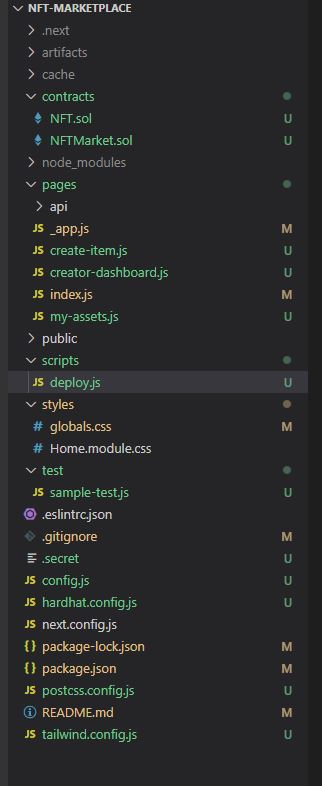
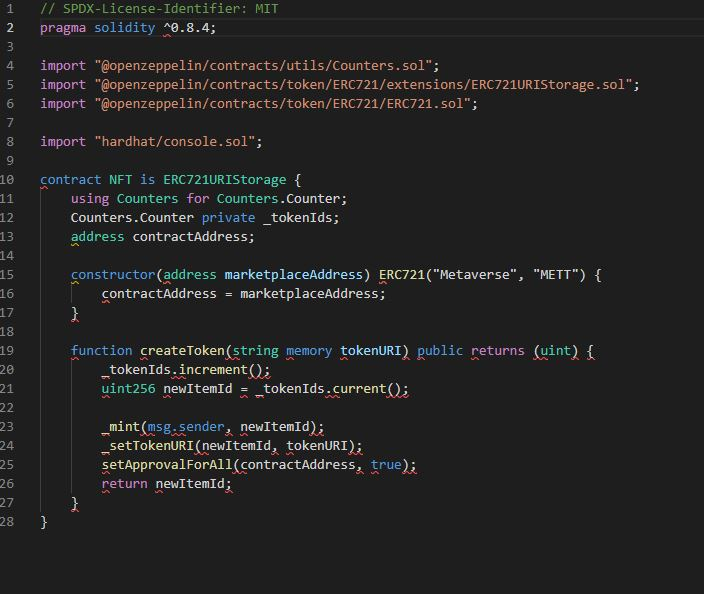
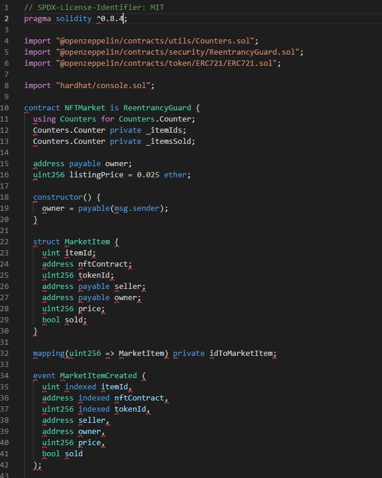
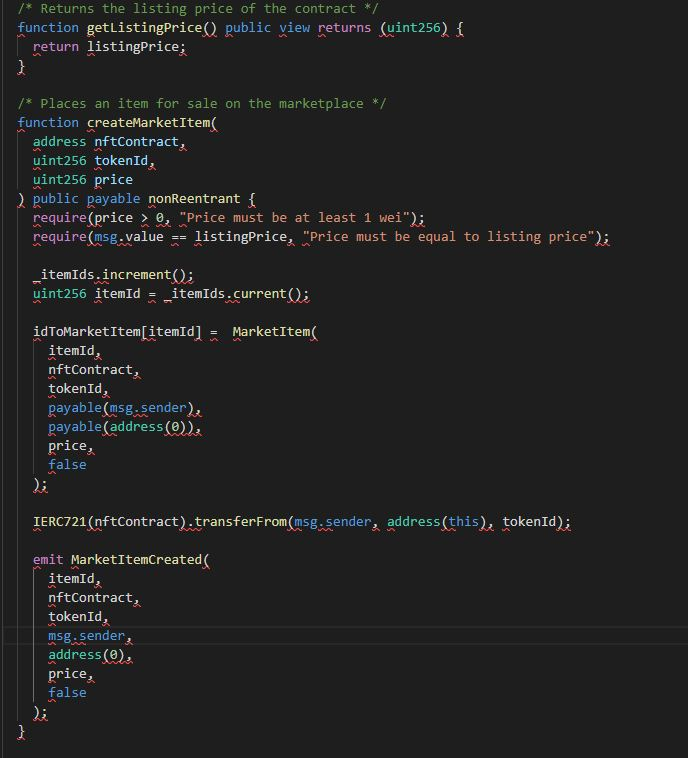
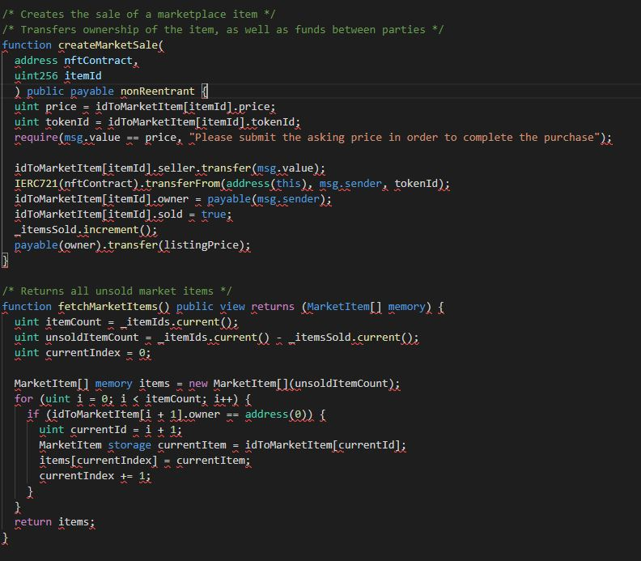
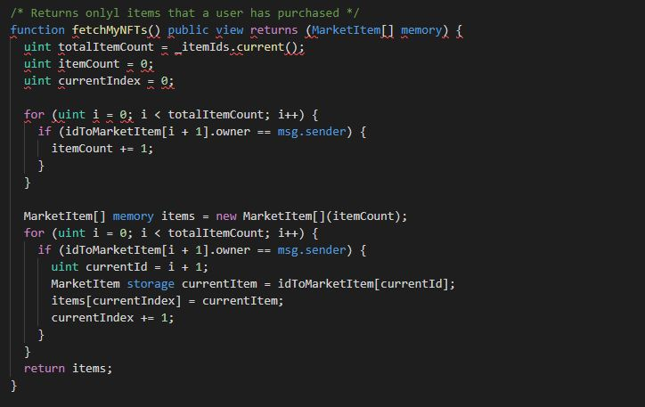
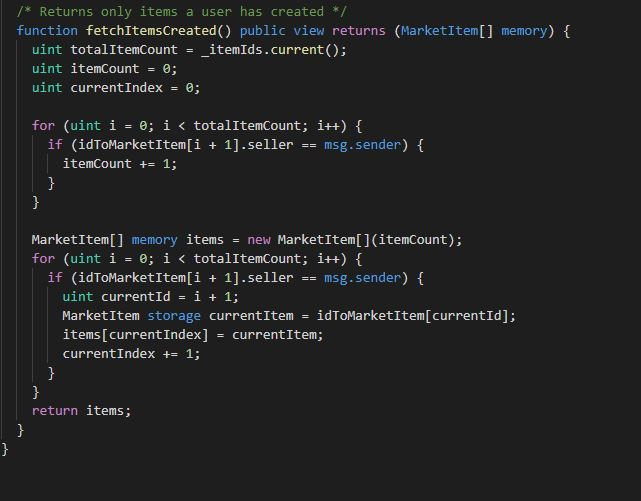
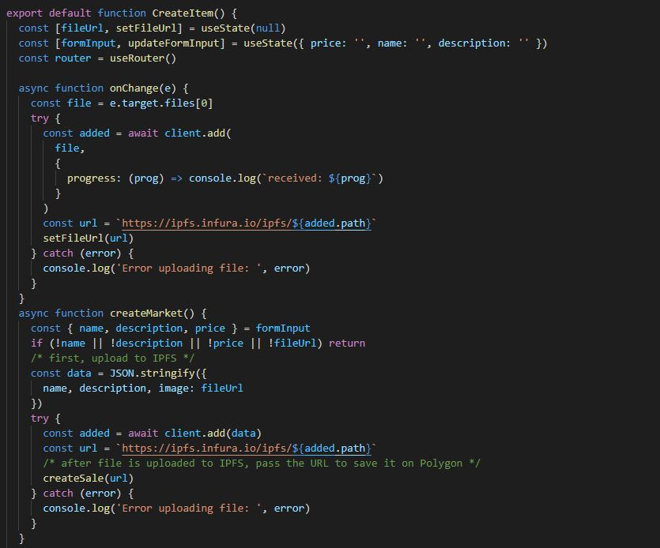
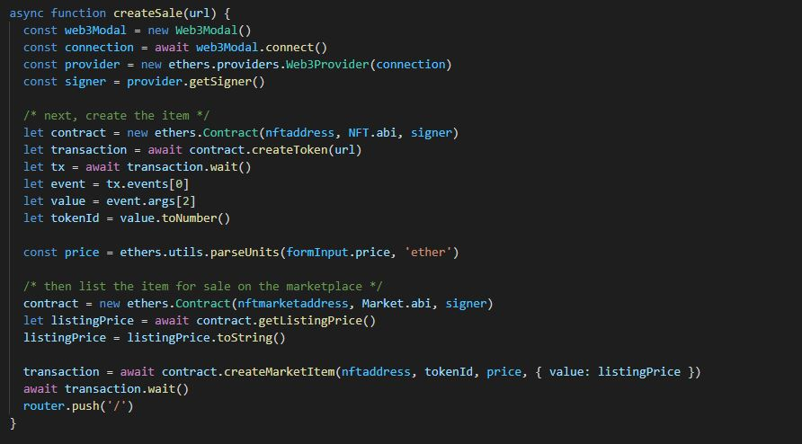

# NFT_Marketplace_and_ Generator

# Introduction

The goal of this project was to create a NFT market place that housed a NFT generator which incorporated our own tokens. We called this Picasso. Picasso's original concept included a token that would allow users to buy, sell and create their own NFTs. 
This read me spells out the procedure of NFT generation as well as marketplace creation process, the challenges we faced and our future plans to enhance Picasso. 

# Procedure

## Autogeneration of NFT
 
 The generation of the specific NFT was created using the following code

`background = ["Blue", "Orange"]`
`background_weights = [30,15]`

`circle = ["Blue", "Orange"]`
`circle_weights = [30,15]`

`square = ["Blue", "Orange"]`
`square_weights = [30,15]`

`#Creating dictionary variables for the traits`

`background_files = {` 
    `"Blue" : "blue",`
    `"Orange" : "orange",`
`}`

`square_files = {`
    `"Blue" : "blue-square",`
    `"Orange" : "orange-square",`
`}`

`circle_files = {`
    `"Blue" : "blue-circle",`
    `"Orange" : "orange-circle",`
`}`

add pics of picassos 

The link for the full pic generation can be found under

**Project_3 --> generator --> 'pic_generator.ipynb**

## Creation of Market Place

The .sol file that created the market place can be found under

** nft-marketplace **

# Challenges

Our biggest challenge  was really to incorporate all the technologies neccessary to create a robust market place that incorporated all our ideas. 

# Technology 

## Packages
- PIL from Image
- Ipython from display
- Random
- Json

## Other Technology
- Jupyter Lab
- Power shell
- Node.JS 
- Polygon
- Metamask
- Web3.modal
- Solidity
- JavaScript
- Open zeppelin
- Tokenonmics
- Hard Hat

# Visualizations

# Conclusion/Future Plans

During this project we learned a lot about several technologies as well as the process of creating the market place which will be the future. 
Our future plans can be divided into two aspects: 
1. I would like to enhance the features and capabilities of the NFT generator. 
2. I would like to further flesh out the Marketplace. 
